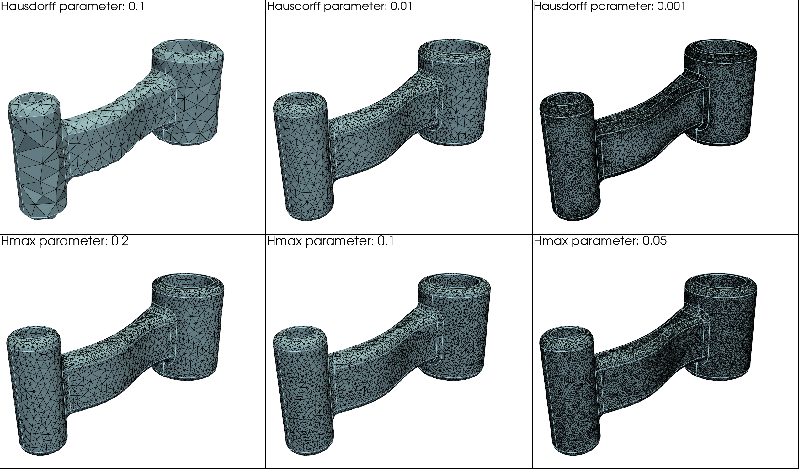
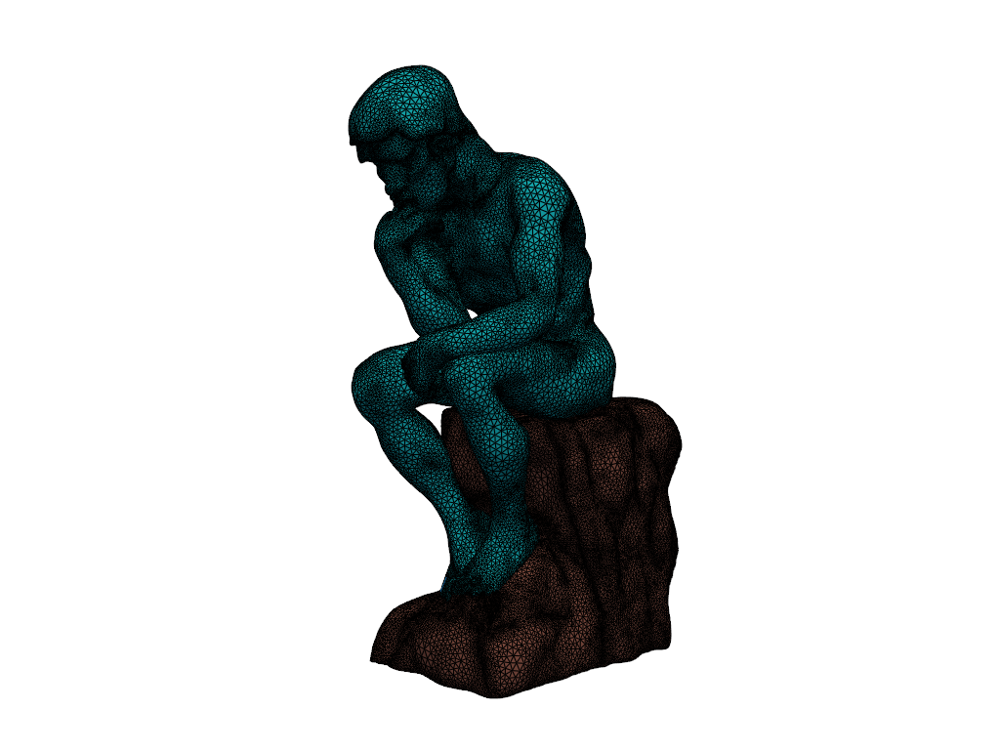
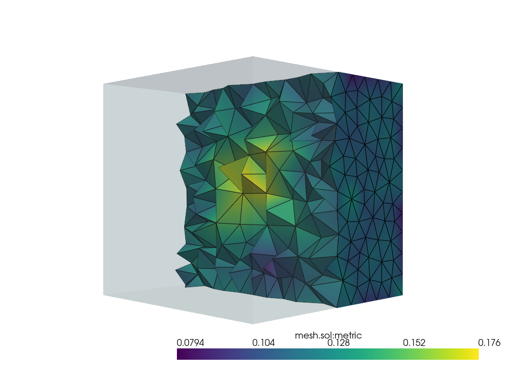

# mmgpy

[](https://pypi.org/project/mmgpy/)
[](https://anaconda.org/conda-forge/mmgpy)
[](https://pypi.org/project/mmgpy/)
[](LICENSE)
[](https://kmarchais.github.io/mmgpy)
[](https://codecov.io/gh/kmarchais/mmgpy)

**mmgpy** brings the power of [MMG](https://www.mmgtools.org) mesh adaptation to Python. Generate, optimize, and refine 2D, 3D, and surface meshes through a native PyVista accessor.

```python
import pyvista as pv
import mmgpy  # noqa: F401  -- registers the .mmg accessor + Medit reader/writer

mesh = pv.read("input.mesh")
remeshed = mesh.mmg.remesh(hmax=0.1)
remeshed.save("output.vtk")
```



## Try It

No installation needed, run directly with [uvx](https://docs.astral.sh/uv/):

```bash
# Remesh a mesh file from the command line
uvx mmgpy input.stl -o output.mesh -hmax 0.1

# Launch the interactive UI
uvx --from "mmgpy[ui]" mmgpy-ui
```

## Installation

The recommended way to install mmgpy:

```bash
uv pip install mmgpy
```

This uses pre-built wheels from PyPI that bundle all native libraries (MMG, VTK), no compiler needed.

### Other install methods

```bash
# pip
pip install mmgpy

# conda-forge
conda install -c conda-forge mmgpy

# With UI support
uv pip install "mmgpy[ui]"

# With elasticity-based displacement propagation
uv pip install "mmgpy[fem]"
```

### PyVista accessor (`mesh.mmg.remesh(...)`)

The `.mmg` accessor and the Medit `.mesh` / `.meshb` reader/writer (see [How it works](#how-it-works)) activate whenever **pyvista >= 0.48** is importable in the same environment as mmgpy. Either of these gives you that:

```bash
pip install mmgpy pyvista        # mmgpy + latest pyvista
pip install "mmgpy[pyvista]"     # same effect, version-pinned to >=0.48,<1
```

If pyvista isn't installed (or is older than 0.48, which predates the plugin entry-point system), the accessor simply isn't registered. `import mmgpy` still works, and the in-memory `MmgMesh2D` / `MmgMesh3D` / `MmgMeshS` API and `mmgpy.mmgs.remesh(...)` file path stay available.

### Without PyVista

For headless / server / CI use, the slim install (`pip install mmgpy`, no pyvista, no VTK) exposes the C-binding mesh classes directly. Build a mesh from numpy arrays, attach fields via item syntax, and remesh in place:

```python
import numpy as np
from mmgpy import MmgMeshS

mesh = MmgMeshS(vertices, triangles)        # numpy arrays, shape (Nv, 3) and (Nt, 3)
mesh["metric"] = sizing_array               # optional: per-vertex isotropic size
mesh.remesh(hmin=0.01, hmax=0.1, hausd=0.005)

verts_out = mesh.get_vertices()
tris_out = mesh.get_triangles()
```

`MmgMesh2D` (planar triangular) and `MmgMesh3D` (tetrahedral) follow the same pattern. File-based round trips are also available without pyvista via `mmgpy.mmg2d.remesh(in_path, out_path, options={...})` and its `mmg3d` / `mmgs` siblings.

### Using uv for project management

```bash
uv add mmgpy                 # add to project dependencies
uv tool install mmgpy        # install CLI tools globally
uv tool install "mmgpy[ui]"  # install CLI tools + UI globally
```

### PyPI vs conda-forge

|                   | PyPI (pip/uv)                 | conda-forge (Linux/macOS)           |
| ----------------- | ----------------------------- | ----------------------------------- |
| **Install speed** | Fast (pre-built wheels)       | Slower (solver + download)          |
| **Dependencies**  | Bundled (self-contained)      | Shared across packages              |
| **Disk usage**    | Larger (duplicate VTK/libs)   | Smaller in conda environments       |
| **Best for**      | Quick setup, isolated use, CI | Scientific stacks sharing VTK/NumPy |

Use **PyPI** (`uv pip install`) for the fastest setup. Use **conda-forge** when you already have a conda environment with VTK, PyVista, or other scientific packages.

## How it works

Importing `mmgpy` registers a PyVista plugin that adds two things to every `pv.UnstructuredGrid` and `pv.PolyData`:

- A **`.mmg` accessor** that exposes the full MMG API: `remesh`, `remesh_optimize`, `remesh_uniform`, `remesh_levelset`, `move`, `validate`, `element_qualities`, and more.
- A **Medit reader/writer** for `.mesh` and `.meshb` files (with auto-loading of companion `.sol` files into `point_data` / `cell_data`).

Every accessor call returns a fresh PyVista dataset, so the result composes with the rest of the PyVista API (slicing, plotting, IO).

## Features

- **Multi-dimensional**, 2D triangular, 3D tetrahedral, and surface meshes (auto-detected from cell types via `dataset.mmg.kind`).
- **Local refinement**, sphere / box / cylinder / point-based sizing, passed as `local_sizing=[...]` on `remesh`.
- **Anisotropic adaptation**, metric tensors in `point_data["metric"]`, including least-squares Hessian recovery from a scalar field.
- **Level-set discretization**, extract isosurfaces from implicit functions via `mesh.mmg.remesh_levelset(...)`; multi-material splits via `set_multi_materials`.
- **Lagrangian motion**, move boundaries and remesh through `mesh.mmg.move(displacement, ...)`, with a Laplacian propagator or an optional elasticity backend (`fedoo`).
- **Required entities**, lock vertices, edges, triangles, or tetrahedra during remeshing via kwargs (`required_triangles=...`) or `mmg_*` data tags.
- **Companion `.sol` I/O**, scalar / vector / tensor fields via `load_sol`, `save_sol`, `load_all_sols`, `save_all_sols`.
- **Validation & quality**, `mesh.mmg.validate(detailed=True)` returns a `ValidationReport`; `mesh.mmg.element_qualities()` returns MMG's in-radius ratios.
- **40+ file formats**, native Medit, plus everything PyVista supports (VTK, STL, OBJ, GMSH, MED, Abaqus, etc.; install `pyvista[io]` for meshio-backed formats).

## Usage

### Basic remeshing

```python
import pyvista as pv
import mmgpy  # noqa: F401

mesh = pv.read("input.mesh")
remeshed = mesh.mmg.remesh(hmax=0.1)

q_before = mesh.mmg.element_qualities()
q_after = remeshed.mmg.element_qualities()
print(f"Quality: {q_before.mean():.2f} -> {q_after.mean():.2f}")

remeshed.save("output.vtk")
```

### Local sizing

Refine inside specific regions without touching the rest of the mesh:

```python
remeshed = mesh.mmg.remesh(
    hmax=0.1,
    local_sizing=[
        {"shape": "sphere", "center": [0.5, 0.5, 0.5], "radius": 0.2, "size": 0.01},
        {"shape": "box", "bounds": [[0, 0, 0], [0.3, 0.3, 0.3]], "size": 0.02},
        {"shape": "cylinder", "point1": [0, 0, 0], "point2": [0, 0, 1],
         "radius": 0.1, "size": 0.01},
        {"shape": "from_point", "point": [0.5, 0.5, 0.5],
         "near_size": 0.01, "far_size": 0.1, "influence_radius": 0.3},
    ],
)
```

### Typed options

```python
from mmgpy import Mmg3DOptions

opts = Mmg3DOptions(hmin=0.01, hmax=0.1, hausd=0.001)
remeshed = mesh.mmg.remesh(opts)

# Or use presets
remeshed = mesh.mmg.remesh(Mmg3DOptions.fine(hmax=0.05))
```

### Anisotropic metrics

Drop a per-vertex metric on `point_data["metric"]` and `remesh()` picks it up:

```python
import numpy as np
import mmgpy.metrics as metrics

sizes = np.full(mesh.n_points, 0.05)
mesh.point_data["metric"] = metrics.create_isotropic_metric(sizes)

remeshed = mesh.mmg.remesh()
```

For solution-adaptive remeshing, recover a Hessian and convert it to a metric:

```python
from mmgpy.metrics import compute_hessian, create_metric_from_hessian

hessian = compute_hessian(vertices, triangles, field)
mesh.point_data["metric"] = create_metric_from_hessian(
    hessian, target_error=5e-3, hmin=3e-3, hmax=8e-2,
)
remeshed = mesh.mmg.remesh(hgrad=2.0)
```

### Level-set discretization

```python
import numpy as np

levelset = (
    np.linalg.norm(mesh.points - [0.5, 0.5, 0.5], axis=1) - 0.3
).reshape(-1, 1)

discretized = mesh.mmg.remesh_levelset(levelset)
```

### Lagrangian motion

Apply a per-vertex displacement and remesh to maintain element quality:

```python
import numpy as np

displacement = np.zeros((mesh.n_points, 3))
displacement[:, 0] = 0.1

moved = mesh.mmg.move(displacement, hmax=0.1)
```

Pass only boundary values plus `propagate=True` to fill the interior. The default is a Laplacian smoother; pass `propagation_method="elasticity"` to use the `fedoo`-backed linear-elasticity solver (`uv pip install "mmgpy[fem]"`).

### Locking entities

Keep specific vertices, edges, triangles, or tetrahedra fixed during remeshing:

```python
remeshed = mesh.mmg.remesh(
    hmax=0.1,
    required_triangles=np.array([3, 7, 11], dtype=np.int32),
)
```

Or attach the constraint to the dataset (it travels through `save` / `copy`):

```python
mask = np.zeros(mesh.n_cells, dtype=bool)
mask[[3, 7, 11]] = True
mesh.cell_data["mmg_required_triangles"] = mask
remeshed = mesh.mmg.remesh(hmax=0.1)
```

### Visualization

```python
remeshed.plot(show_edges=True)
```

The accessor returns a regular PyVista dataset, so anything PyVista does (slicing, integration, custom plotters) works directly on the result.

## Command Line

MMG executables are bundled with the wheel:

```bash
# Auto-detect mesh type
mmg input.mesh -o output.mesh -hmax 0.1

# Or use specific commands
mmg3d input.mesh -o output.mesh -hmax 0.1
mmgs surface.stl -o refined.mesh -hausd 0.001
mmg2d domain.mesh -o refined.mesh -hmax 0.05

# Check versions
mmg --version
```

The `_O3` suffix variants (`mmg3d_O3`, etc.) are also available for compatibility.

## Gallery






## Documentation

**[kmarchais.github.io/mmgpy](https://kmarchais.github.io/mmgpy)**

- [Quick Start](https://kmarchais.github.io/mmgpy/getting-started/quickstart/)
- [Tutorials](https://kmarchais.github.io/mmgpy/tutorials/basic-remeshing/)
- [API Reference](https://kmarchais.github.io/mmgpy/api/)
- [Examples](https://kmarchais.github.io/mmgpy/examples/)

## Contributing

Contributions are welcome. See [CONTRIBUTING.md](CONTRIBUTING.md) for development setup, coding standards, and the pull request process.

## License

MIT
