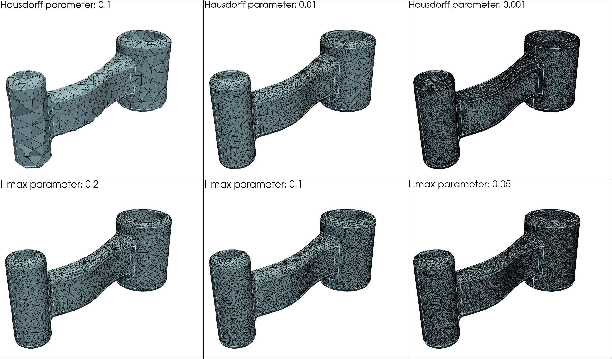
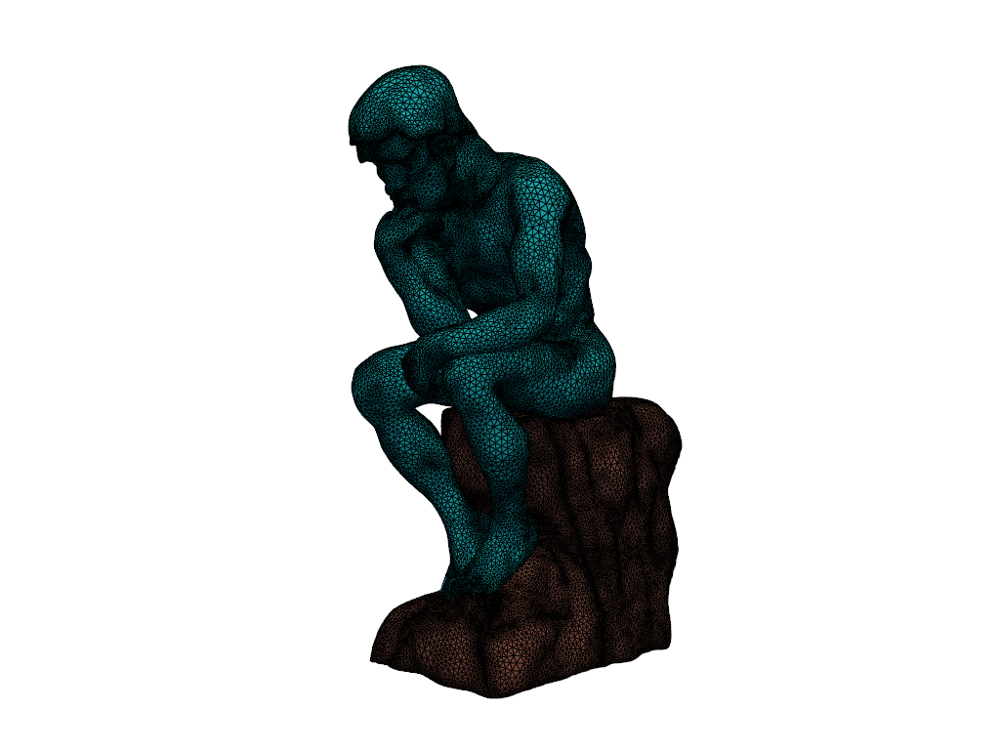
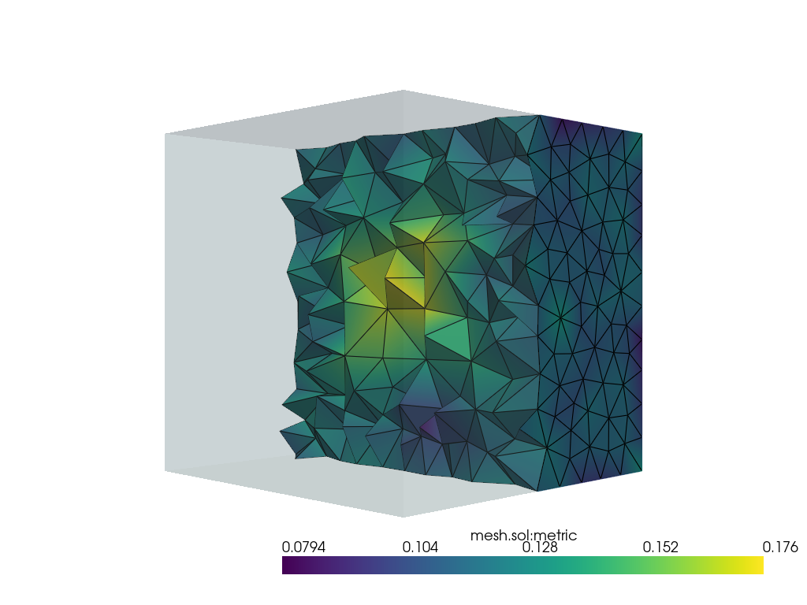

# mmgpy

This is a Python package that provides bindings for the [MMG software](https://www.mmgtools.org) for mesh generation and optimization.
The goal in the end is to provide a pythonic interface to mmg's capabilities.

Example from [`examples/mmgs/mechanical_piece_remeshing.py`](https://github.com/kmarchais/mmgpy/blob/main/examples/mmgs/mechanical_piece_remeshing.py) ([original tutorial](https://www.mmgtools.org/mmg-remesher-try-mmg/mmg-remesher-tutorials/mmg-remesher-mmgs/mmg-remesher-mechanical-piece-remeshing)):


Example from [`examples/mmgs/smooth_surface_remeshing.py`](https://github.com/kmarchais/mmgpy/blob/main/examples/mmgs/smooth_surface_remeshing.py) ([original tutorial](https://www.mmgtools.org/mmg-remesher-try-mmg/mmg-remesher-tutorials/mmg-remesher-mmgs/mmg-remesher-smooth-surface-remeshing)):


Example from [`examples/mmg3d/mesh_quality_improvement.py`](https://github.com/kmarchais/mmgpy/blob/main/examples/mmg3d/mesh_quality_improvement.py) ([original tutorial](https://www.mmgtools.org/mmg-remesher-try-mmg/mmg-remesher-tutorials/mmg-remesher-mmg3d/mesh-quality-improvement-with-mean-edge-lengths-preservation)):


## Installation

To install the package, run the following command (from Windows or MacOS), the Linux package is not available on PyPI yet and needs the next command to be installed:

```bash
pip install mmgpy
```

Or directly from this repository:

```bash
pip install git+https://github.com/kmarchais/mmgpy.git
```

for `uv` users:

```bash
uv pip install mmgpy
```

## Build dependencies

- pybind11: Used for Python bindings

  - BSD 3-Clause License
  - Copyright (c) 2016 Wenzel Jakob <wenzel.jakob@epfl.ch>

- CMake (>= 3.0): Build system

  - BSD 3-Clause License
  - Copyright 2000-2024 Kitware, Inc. and Contributors

- scikit-build: Python build system integration

  - MIT License
  - Copyright (c) 2014 Mike Sarahan

- pytest: Testing framework

  - MIT License
  - Copyright (c) 2004 Holger Krekel and others
