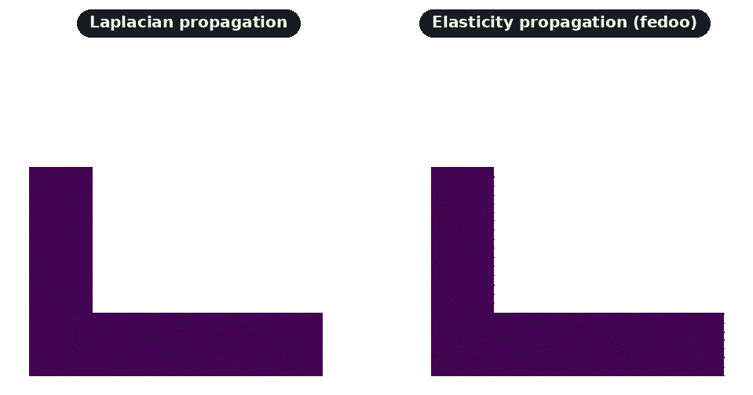

# Lagrangian Motion

This page documents the Lagrangian mesh motion functions in the `mmgpy.lagrangian` module and the `dataset.mmg.move(...)` accessor method.

## Overview

Lagrangian remeshing handles moving meshes by:

1. Applying a displacement field to the mesh
2. Remeshing to maintain quality
3. Preserving boundary conditions

This is useful for:

- Moving mesh simulations
- Shape optimization
- Fluid-structure interaction
- Morphing between shapes

`dataset.mmg.move()` applies the displacement and remeshes for every mesh kind (TET, 2D, surface) with no external dependency. For interior propagation it ships two solvers: a pure-Python Laplacian smoother (default) and an optional fedoo-backed linear elasticity solver, selectable via `propagation_method`.

```python
import numpy as np
import pyvista as pv
import mmgpy  # noqa: F401  -- registers reader/writer + accessor

sphere = pv.Sphere(theta_resolution=10, phi_resolution=10)
displacement = np.zeros((sphere.n_points, 3))
displacement[:, 0] = 0.1  # Move in x direction

moved = sphere.mmg.move(displacement, hausd=0.01)
```

## Functions

::: mmgpy.move_mesh
options:
show_root_heading: true

::: mmgpy.propagate_displacement
options:
show_root_heading: true

::: mmgpy.lagrangian.propagate_displacement_elasticity
options:
show_root_heading: true

::: mmgpy.detect_boundary_vertices
options:
show_root_heading: true

`propagate_displacement_elasticity` requires the optional
[`fedoo`](https://github.com/3MAH/fedoo) backend (`pip install "mmgpy[fem]"`).
On a cantilever bracket the Laplacian solver pivots the geometry rigidly
while the elasticity solver captures the bending kinematics:




See the [Elasticity Propagation tutorial](../tutorials/elasticity-propagation.md)
for a full walkthrough.

!!! info "fedoo on conda-forge"
`fedoo` is published on PyPI but not on conda-forge. If you installed mmgpy
from conda-forge, install fedoo separately with
`pip install fedoo` (or `conda install -c set3MAH fedoo`) inside the same
environment to enable elasticity propagation.

!!! warning "Deprecated: `remesh_lagrangian`"
`Mesh.remesh_lagrangian()`, `dataset.mmg.remesh_lagrangian()` and
`mmgpy.progress.remesh_mesh_lagrangian()` are kept as deprecation shims
that forward to `mmgpy.move_mesh` / `dataset.mmg.move`. They emit a
`DeprecationWarning` and will be removed in a future release; new code
should call the `move`/`move_mesh` API directly.

## Accessor Method

<!-- pytest-codeblocks:skip -->

```python
import numpy as np
import pyvista as pv
import mmgpy  # noqa: F401

mesh = pv.read("input.mesh")

# Define displacement field (3D vector at each vertex)
displacement = np.zeros((mesh.n_points, 3))
displacement[:, 0] = 0.1

moved = mesh.mmg.move(displacement)
```

## Usage Examples

### Basic Lagrangian Remeshing

<!-- pytest-codeblocks:skip -->

```python
import numpy as np
import pyvista as pv
import mmgpy  # noqa: F401

mesh = pv.read("input.mesh")
vertices = np.asarray(mesh.points)

# Create displacement: radial expansion
center = vertices.mean(axis=0)
directions = vertices - center
distances = np.linalg.norm(directions, axis=1, keepdims=True)
directions = directions / (distances + 1e-10)
displacement = directions * 0.1 * distances

remeshed = mesh.mmg.move(displacement)
print(f"Cells: {mesh.n_cells} -> {remeshed.n_cells}")
```

### Boundary-Only Displacement

Move only boundary vertices and let `move()` propagate the displacement into the interior. PyVista's `extract_surface` gives the boundary vertex set for any mesh kind:

<!-- pytest-codeblocks:skip -->

```python
import numpy as np
import pyvista as pv
import mmgpy  # noqa: F401

mesh = pv.read("input.mesh")
surface = mesh.extract_surface()
boundary_mask = np.zeros(mesh.n_points, dtype=bool)
boundary_mask[surface.point_data["vtkOriginalPointIds"]] = True

displacement = np.zeros((mesh.n_points, 3))
displacement[boundary_mask, 2] = 0.05

moved = mesh.mmg.move(
    displacement,
    boundary_mask=boundary_mask,
    propagate=True,
    hmax=0.1,
)
```

### Iterative Motion

For large deformations, use multiple sub-steps via the `n_steps` argument:

<!-- pytest-codeblocks:skip -->

```python
moved = mesh.mmg.move(total_displacement, n_steps=10, hmax=0.1, verbose=-1)
```

### With Quality Control

Combine with remeshing parameters:

<!-- pytest-codeblocks:skip -->

```python
remeshed = mesh.mmg.move(
    displacement,
    hmin=0.01,
    hmax=0.1,
    hausd=0.001,
    verbose=1,
)
```

## Complete Example

Deform a sphere into an ellipsoid:

<!-- pytest-codeblocks:skip -->

```python
import numpy as np
import pyvista as pv
import mmgpy  # noqa: F401

mesh = pv.read("sphere.mesh")
vertices = np.asarray(mesh.points)

# Compute displacement: stretch in z, compress in x and y
center = vertices.mean(axis=0)
relative = vertices - center
scale = np.array([0.7, 0.7, 1.5])  # Compress x,y, stretch z
displacement = (center + relative * scale) - vertices

remeshed = mesh.mmg.move(displacement, hmax=0.1, verbose=1)

q = remeshed.mmg.element_qualities()
print(f"Vertices: {mesh.n_points} -> {remeshed.n_points}")
print(f"Mean quality: {q.mean():.3f}")

remeshed.save("ellipsoid.vtk")
```

## Tips

1. **Small steps**: For large deformations, pass `n_steps > 1` to `dataset.mmg.move(...)`.
2. **Quality monitoring**: Check `dataset.mmg.element_qualities()` after each step.
3. **Boundary handling**: Use `boundary_mask` + `propagate=True` for interior smoothness.
4. **Remesh parameters**: Combine with `hmax`, `hausd` for size control.
5. **Validation**: Validate the mesh between steps with `dataset.mmg.validate()`.
