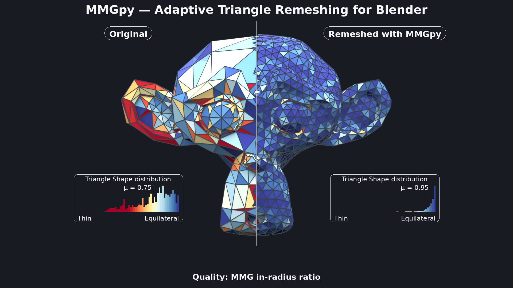
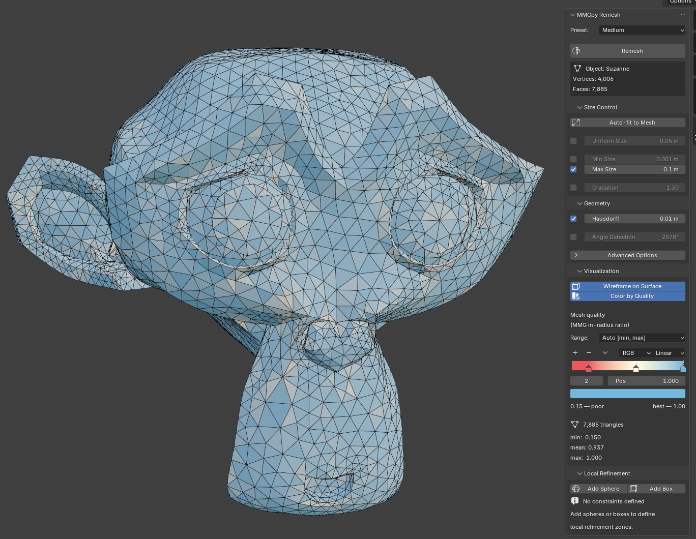
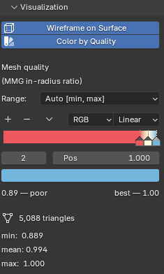

# Blender extension



<video controls muted loop playsinline width="100%" poster="assets/blender/featured-image.png">
  <source src="assets/blender/preview-video.mp4" type="video/mp4">
</video>

mmgpy ships a Blender 4.2+ add-on that exposes the remeshing pipeline
through Blender's UI, no scripting required. Under the hood it builds
a [`pyvista.PolyData`][pyvista.PolyData] from the active mesh and runs
`polydata.mmg.remesh(...)` against [PyVista's `.mmg` accessor][accessor],
so every option that's available from Python is reachable from the
N-panel.

[accessor]: api/index.md
[pyvista.PolyData]: https://docs.pyvista.org/api/core/_autosummary/pyvista.PolyData

!!! info "Requirements"

    - Blender **4.2+** (uses the new Extensions system)
    - The released zips bundle mmgpy and every transitive dependency
      (numpy, pyvista, scipy, vtk, matplotlib, …). No separate `pip
      install` is needed inside Blender's Python.

## Install

### Option 1 — extensions.blender.org (recommended once published)

Search for **MMGpy** in Blender's **Edit → Preferences → Get
Extensions** browser, click **Install**. Blender picks the right
platform / Python-ABI zip automatically and handles updates.

### Option 2 — install a zip from a GitHub release

Each tagged release on
[GitHub releases](https://github.com/kmarchais/mmgpy/releases)
publishes one zip per (platform, Python ABI) combination. Pick the row
that matches your Blender install:

| Filename suffix            | Blender versions | Python ABI |
| -------------------------- | ---------------- | ---------- |
| `*-linux-x64-py3.11.zip`   | 4.2 LTS — 4.5    | 3.11       |
| `*-windows-x64-py3.11.zip` | 4.2 LTS — 4.5    | 3.11       |
| `*-macos-arm64-py3.11.zip` | 4.2 LTS — 4.5    | 3.11       |
| `*-linux-x64-py3.13.zip`   | 5.x              | 3.13       |
| `*-windows-x64-py3.13.zip` | 5.x              | 3.13       |
| `*-macos-arm64-py3.13.zip` | 5.x              | 3.13       |

Then in Blender:

1. **Edit → Preferences → Get Extensions**.
2. Click **▼** at the top-right and choose **Install from Disk…**.
3. Select the downloaded zip.
4. Confirm the install in **Add-ons → MMGpy**; the status box shows
   the bundled mmgpy + MMG versions.

Each zip is ~150 MB — the bulk is VTK (~60 MB), SciPy (~40 MB),
NumPy (~15 MB), and matplotlib (~10 MB).

## Where the UI lives

Open the 3D Viewport sidebar with **N** and switch to the **MMGpy**
tab. The main panel has four collapsible sub-panels:

- **Size Control** — `hmin` / `hmax` / `hsiz` / gradation
- **Geometry** — Hausdorff distance, angle detection, advanced flags
- **Visualization** — wireframe overlay and quality colormap
- **Local Refinement** — sphere / box Empties as refinement zones



## Basic remesh

1. Select a mesh object.
2. (Optional) hit **Auto-fit to Mesh** in the Size Control panel — it
   sizes `hmin` / `hmax` / `hsiz` / `hausd` to a power of 10 matching
   the object's bounding-box diagonal.
3. Pick a preset (Fine / Medium / Coarse) or tweak the sliders.
4. Click **Remesh** at the top of the panel.

| Preset | Gradation override | Notes                                             |
| ------ | ------------------ | ------------------------------------------------- |
| Fine   | `hgrad=1.2`        | high quality, smaller elements, tight transitions |
| Medium | default            | balanced quality and performance                  |
| Coarse | `hgrad=1.5`        | fast remeshing, larger elements                   |
| Custom | manual             | full control over every parameter                 |

The operator declares `REGISTER, UNDO` so a remesh is one **Ctrl+Z**
away from the previous mesh state.

!!! warning "High-triangle confirmation"

    If the estimated output element count (computed from the active
    `hsiz` / `hmax` and the mesh's surface area) exceeds 1,000,000, a
    confirmation dialog asks whether to proceed. This is to keep
    Blender's UI from locking up on inadvertently-huge inputs.

## Local refinement zones

Use Empties as refinement zones. Each one becomes a `local_sizing`
entry on the `.mmg.remesh` call.

1. Expand **Local Refinement**.
2. Click **Add Sphere** or **Add Box**. An Empty is created at the
   active object's location.
3. Move / scale the Empty. Its `empty_display_size` controls the
   sphere radius or box half-extent.
4. Set the Empty's per-zone **Target Size**.
5. Repeat as needed, then **Remesh**.

Behind the scenes each constraint maps to

```python
{"shape": "sphere",  "center": [...], "radius": ..., "size": ...}
# or
{"shape": "box",     "bounds":  [...],                 "size": ...}
```

in the `local_sizing=[...]` kwarg.

## Quality visualisation

Two independent toggles in the **Visualization** sub-panel:

### Wireframe on Surface

Flips `obj.show_wire` and `obj.show_all_edges` on the active mesh, so
the wireframe overlays the shaded surface in every viewport shading
mode. Persists across remeshes (the operator re-pokes the flag after
swapping the mesh data so the viewport's overlay cache refreshes).

### Color by Quality

Computes [MMG's in-radius-ratio quality][quality] per triangle, writes
the values to a `mmgpy_quality` `FACE`-domain attribute, and assigns a
shared `MMGpy_Quality` material whose shader graph is
`Attribute → ColorRamp → Principled BSDF`. The ColorRamp is rendered
**live in the panel** via `template_color_ramp`, so the gradient you
see on the mesh is the gradient the material is using — and you can
drag the stops to re-grade in place.

[quality]: https://www.mmgtools.org/

The palette is ColorBrewer's **RdYlBu**: red = poor, yellow =
middling, blue = excellent. Toggling the option flips the viewport to
**Material Preview** if it isn't already on a material-aware shading
mode.

Three range modes:

| Mode                  | Ramp stops at                   | Use case                                          |
| --------------------- | ------------------------------- | ------------------------------------------------- |
| **Absolute [0, 1]**   | `0.0` / `0.5` / `1.0`           | Universal scale (0 = degenerate, 1 = equilateral) |
| **Auto [min, max]**   | actual `min` / midpoint / `max` | Emphasises in-mesh variation                      |
| **Custom [min, max]** | user-set bounds                 | Compare two meshes on a fixed scale               |

A stats block underneath shows the active mesh's `min` / `mean` /
`max` plus the triangle count.

!!! info "Quality coloring requires an all-triangle mesh"

    Fresh remesh output is always all-triangle, so the feature works
    out-of-the-box after **Remesh**. For meshes with ngons / quads,
    triangulate first (`Ctrl + T` in Edit Mode).



## Building from source

For most users the released zips are the right path. To build locally
against an unreleased mmgpy version, the canonical pipeline lives in
[`.github/workflows/build-blender-extension.yml`][workflow].

[workflow]: https://github.com/kmarchais/mmgpy/blob/main/.github/workflows/build-blender-extension.yml

In short:

<!-- mmgpy-test:skip -->

```bash
# 1. Build the mmgpy wheel into ./blender_mmgpy/wheels
uv build --wheel --out-dir blender_mmgpy/wheels

# 2. Fill in transitive deps for the target ABI + platform
cd blender_mmgpy
pip download mmgpy \
    --find-links wheels --dest wheels \
    --only-binary :all: \
    --python-version 3.13 \
    --platform win_amd64 --platform any   # adjust for your platform

# 3. Inject `wheels = [...]` into the manifest (see CI workflow for
#    the snippet) and let Blender package the zip
blender --command extension build --source-dir . --output-dir .
```

The `./build.sh` script wraps the upstream
[`blender-extension-builder`][bbext] tool, which is the recommended
path for **released** versions of mmgpy. It doesn't work for dev
versions because it tries to `pip download mmgpy` from PyPI; the
manual pipeline above is what the CI release workflow uses.

[bbext]: https://pypi.org/project/blender-extension-builder/

## TODOs / Known limitations

- **Long-running remeshes lock the UI.** The operator runs
  synchronously on Blender's main thread, so a 1M-triangle remesh
  freezes the viewport for tens of seconds. mmgpy exposes
  [`progress=` callbacks](api/index.md) that could feed Blender's
  `wm.progress_*` family for a real progress bar; not wired up yet.
- **Custom palette resets on every refresh.** Whenever the colormap
  range or stats change, the ColorRamp is rebuilt from the canonical
  RdYlBu endpoints. Per-stop edits made directly in the ramp widget
  are lost.
- **No unit tests for `blender_mmgpy/`.** The bpy-dependent code is
  hard to test without Blender installed; the pure helpers
  (`arrays_to_polydata`, `polydata_to_arrays`, `is_all_triangles`)
  could be split out and tested but haven't been yet.
- **Quality coloring is in-radius ratio only.** MMG itself exposes
  one quality metric. PyVista's `cell_quality(quality_measure=…)`
  ships ~20 more (`scaled_jacobian`, `aspect_ratio`, `skew`, …) that
  could be surfaced as another panel dropdown.

## Troubleshooting

### "mmgpy is not installed" in the Add-ons preferences

The bundled wheels didn't match Blender's Python ABI. Use the
`py3.11` zip for Blender 4.x and the `py3.13` zip for Blender 5.x.
If the version still looks wrong, **Disable → Re-enable** the
add-on (forces a Python module reload).

### Quality coloring shows the panel but the mesh stays solid grey

Two possibilities:

- Your viewport is on **Solid** or **Wireframe** shading — materials
  are invisible there. The add-on auto-switches to Material Preview
  on enable, but only on the screen's currently visible 3D
  viewports. Toggle the option off / on if a viewport was created
  after enabling.
- Your mesh isn't all triangles. Check the system console for the
  "Quality visualisation requires an all-triangle mesh" warning;
  triangulate via `Ctrl + T` in Edit Mode and re-enable.

## Licensing

The extension is **GPL-3.0-or-later** because it links against
Blender's `bpy` API (Blender itself is GPL-2.0-or-later, so anything
that imports `bpy` inherits a GPL-compatible licensing requirement).
The bundled MMG library is **LGPL-3.0-or-later**, and mmgpy itself is
MIT. See the SPDX headers and the manifest's `license` field for the
exact identifiers.
