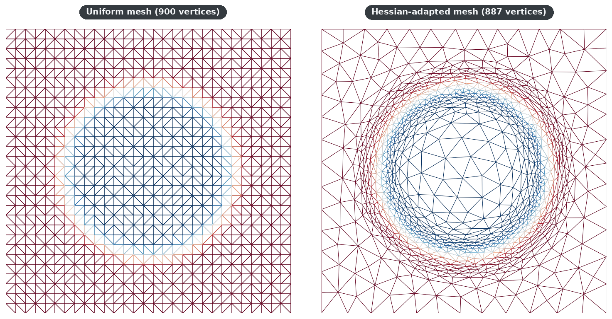
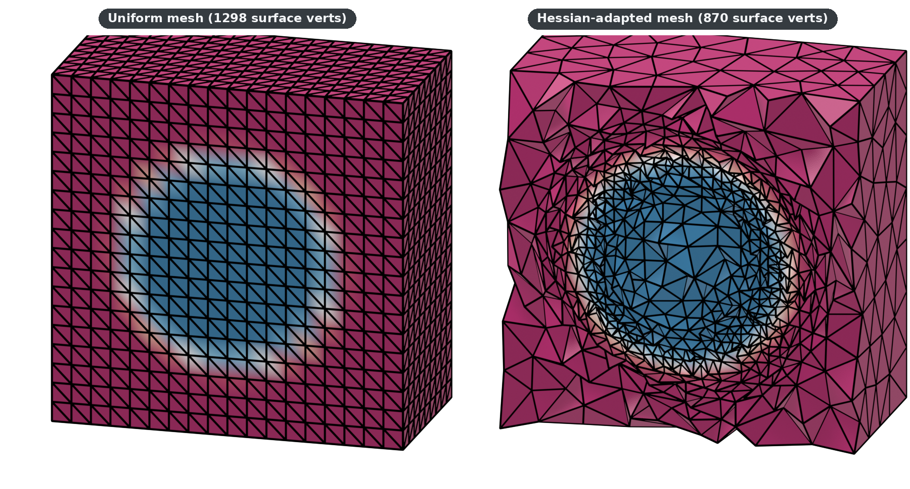

# Hessian-Based Solution-Adaptive Remeshing

Linear-interpolation error on a finite element is bounded by
`|H| · h²`, where `H` is the Hessian (second derivatives) of the field
being interpolated and `h` is the local element size. To keep the error
**uniform** across the mesh, the size should scale as `h ∝ 1 / √|H|`.
The Hessian's eigenstructure also gives a _direction_: large eigenvalues
indicate fronts (shock waves, boundary layers, material interfaces),
where elements should be stretched perpendicular to the front.

mmgpy provides:

- [`compute_hessian`](../api/metrics.md#mmgpy.metrics.compute_hessian)
  — recovers the Hessian by least-squares on a 2-ring patch around each
  vertex.
- [`create_metric_from_hessian`](../api/metrics.md#mmgpy.metrics.create_metric_from_hessian)
  — converts the Hessian into an anisotropic metric tensor that MMG
  consumes via `point_data["metric"]`.

Together they enable the standard solution-adaptive loop:

```text
1. Solve PDE on current mesh        →  field u
2. compute_hessian(...)             →  Hessian
3. create_metric_from_hessian(...)  →  metric
4. mesh.mmg.remesh()                →  adapted mesh
5. Repeat until error is uniform.
```

## 2D demo: circular front

Field `f(x, y) = tanh(40 · (r − 0.3))` with `r = ‖(x, y) − (0.5, 0.5)‖`.
The mesh on the left is uniform; the mesh on the right was adapted from
the same vertex budget but using the Hessian metric. Elements concentrate
in a thin ring around the front and stay coarse elsewhere.



<!-- pytest-codeblocks:skip -->

```python
import mmgpy  # noqa: F401  -- registers the .mmg accessor
from mmgpy import polydata_from_2d_triangles
from mmgpy.metrics import compute_hessian, create_metric_from_hessian

# vertices: (N, 2), triangles: (M, 3)
field = ...  # your scalar solution at vertices

hessian = compute_hessian(vertices, triangles, field)
metric  = create_metric_from_hessian(
    hessian,
    target_error=5e-3,
    hmin=3e-3,
    hmax=8e-2,
)

mesh = polydata_from_2d_triangles(vertices, triangles)
mesh.point_data["solution"] = field
mesh.point_data["metric"]   = metric

adapted = mesh.mmg.remesh(hgrad=2.0)
```

Full script:
[`examples/mmg2d/hessian_adaptation.py`](https://github.com/kmarchais/mmgpy/blob/main/examples/mmg2d/hessian_adaptation.py).

## 3D demo: spherical front

Same idea on a tetrahedral mesh. Field
`f(p) = tanh(40 · (‖p − (0.5, 0.5, 0.5)‖ − 0.3))`. The half-cube cut is
the visualisation only — the metric is computed on the full mesh.



The adapted mesh resolves the spherical front with a single shell of
small tetrahedra; the corners stay coarse. Same vertex budget concentrated
where the Hessian is large.

Full script:
[`examples/mmg3d/hessian_adaptation.py`](https://github.com/kmarchais/mmgpy/blob/main/examples/mmg3d/hessian_adaptation.py).

## Choosing `target_error`, `hmin`, `hmax`

| Parameter      | Effect                                                                             |
| -------------- | ---------------------------------------------------------------------------------- |
| `target_error` | Per-element interpolation error budget. Halving it ≈ doubles the vertex count.     |
| `hmin`         | Floor on element size — prevents the metric from collapsing on a singular Hessian. |
| `hmax`         | Ceiling — prevents arbitrarily large elements far from the feature.                |

A useful starting point: set `target_error` to a few percent of the
field's range, `hmax` to ~1/10 of the domain extent, and `hmin` to
`hmax / 30`.

## Anisotropic vs isotropic

`create_metric_from_hessian` produces an _anisotropic_ metric: when the
Hessian has one dominant eigenvalue (planar fronts, shock waves), MMG
stretches elements along the front and shrinks them across it. For
isotropic adaptation the cheaper recipe is to use the Frobenius norm of
the Hessian as a sizing scalar via
[`create_isotropic_metric`](../api/metrics.md#mmgpy.metrics.create_isotropic_metric)
— but you lose the directional information that makes anisotropic
adaptation efficient near fronts.

## See also

- [API reference: Metrics](../api/metrics.md) for the full function
  signatures.
- [Adaptive Sizing](adaptive-sizing.md) — manual sizing fields when the
  feature you care about is geometric, not solution-driven.
- [Elasticity Propagation](elasticity-propagation.md) — companion feature:
  smoothly move a mesh whose boundary changes shape.
